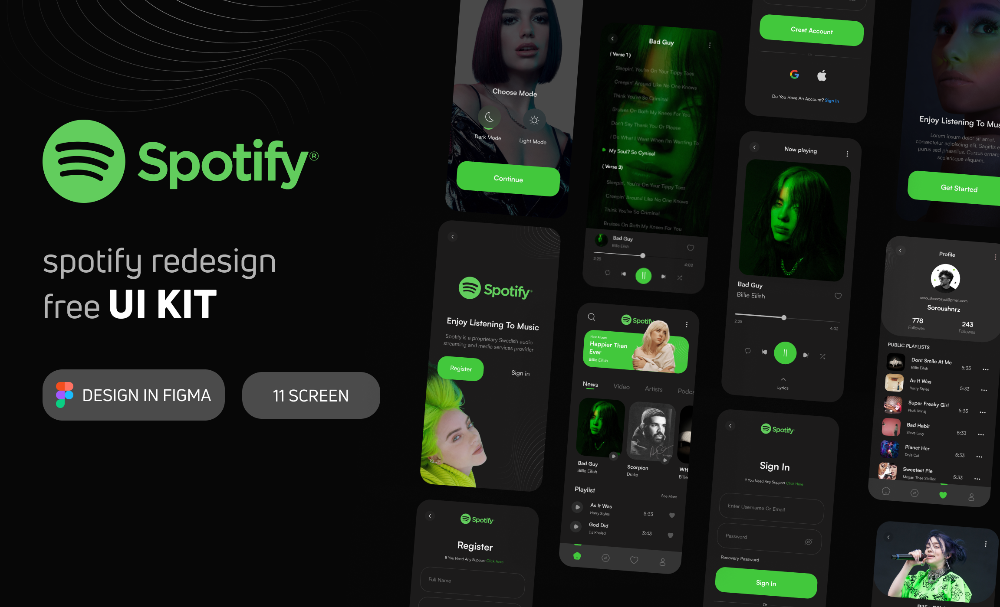

<div align="center">
  
</div><br>

# Spotify - Redesign
O projeto está sendo desenvolvido em react-native com o expo e typescript a fim de estudos.<br>
A ídeia inicial do projeto foi baseada nas videos aulas do [@JovemProgramador](https://www.youtube.com/@JovemProgramadorOficial).

## Mobile
```bash
# Acesse a pasta do projeto pelo terminal (web)
# Faça a instalação das depêndencias
  npm i
# Executando o projeto no ambiente de desenvolvimento
  expo start
```

## Layout
- [Figma](https://www.figma.com/file/9BEBqh3NUnlsrXJU8NcDoF/Spotify-Redesign---Free-Ui-Kit-(Dark-Mode)-(Community)?node-id=1-323&t=pFiQHiwfhBEykvjV-0)

## ✔️ Autores

- [Renan Fachin](https://github.com/RenanFachin/)

## 📄 Referência

- [@JovemProgramador](https://www.youtube.com/@JovemProgramadorOficial)
- [Soroush norozy](https://www.behance.net/soroushnrz)